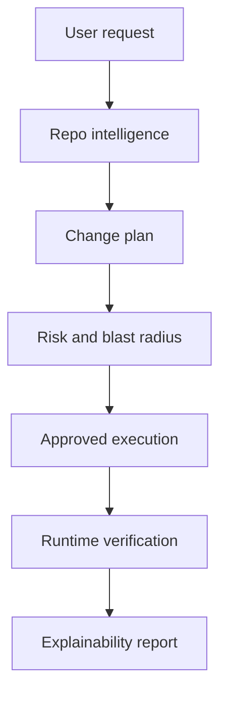

# BootRise

Architecture-aware AI engineering reliability platform.

Repository: `Agent-Work`

BootRise helps teams safely evolve existing software by combining repo intelligence, structured planning, controlled execution, runtime verification, and change explainability.

The core promise is simple: changes start with understanding and end with evidence.

## What Exists Now

- Product and architecture docs in `docs/`.
- Repo intelligence primitives:
  - file classification
  - lightweight symbol extraction
  - import dependency mapping
- Planning primitives:
  - intent interpretation
  - impacted system inference
  - risk assessment
  - ordered execution steps
  - validation plan
- Backend route:
  - `GET /api/plans` returns the example API shape
  - `POST /api/plans` creates a plan from a request
  - `GET /api/repositories/analyze` returns demo repo intelligence and health
  - `POST /api/repositories/analyze` analyzes uploaded file inputs
  - `GET /api/verification` returns the current verification gate
  - `POST /api/verification` runs configured verification commands and records evidence
  - `POST /api/diffs` creates a diff preview for an approved plan
  - `POST /api/executions` executes an approved dry run and generates preview output
  - `GET /api/history` returns in-memory workflow history
- Dry-run execution and report types.
- A clean Next.js App Router dashboard showing repo health, planning, risk, validation evidence, and usage flow.
- SQL persistence schema in `src/lib/persistence/database-schema.sql`.
- Living Ledger memory APIs:
  - `POST /api/memory/index`
  - `POST /api/memory/context`
  - `POST /api/memory/blast-radius`
  - `POST /api/orchestrator`
  - `GET /api/runs`
  - `POST /api/pulses`
  - `POST /api/blueprints`
  - `GET /api/rollbacks`
  - `GET /api/self-healing`
  - `POST /api/workspace/chat` user agent (discovery, feature advice, build guidance)
  - `POST /api/workspace/fix` analyze code, plan fix, blast radius, and report
  - `POST /api/workspace/export` download bundle or GitHub push preparation
  - `GET /api/admin/telemetry`
  - `POST /api/admin/telemetry`
  - `GET /api/admin/deep-tests`
  - `GET /api/admin/readiness`
  - `GET /api/admin/unit-economics`
  - `GET /api/ai/health`
  - `POST /api/ai/admin-chat`
  - `POST /api/ai/planner`
  - `POST /api/builder/execute`
  - `POST /api/builder/run`
  - `GET /api/infrastructure/status`
  - `POST /api/infrastructure/git-sync`
  - `POST /api/infrastructure/preview-sessions`
  - `POST /api/infrastructure/sandbox-pool`
  - `POST /api/infrastructure/vector-sync`
  - `POST /api/infrastructure/streams`
- Mission Control dashboard:
  - interactive blast-radius radar
  - schema and data-flow visualizer
  - live sandbox terminal and preview lane
  - self-healing monitor
  - component hierarchy diff matrix
  - Living Ledger timeline slider
  - executive telemetry command center
- Infrastructure control plane:
  - Git sync network records
  - live preview session records
  - sandbox fleet telemetry
  - vector-memory indexing jobs
  - remote stream contracts for WebContainer, noVNC, Guacamole, and WebRTC adapters

## Product Name

Product name: **BootRise**

Why it works:

- Boot signals structured project foundations instead of loose prompt output.
- Rise signals the product's promise: help software grow without collapsing under complexity.
- The name avoids sounding like another prompt-to-app generator.

## Run Locally

Install dependencies, then start the app:

```bash
npm install
npm run dev
```

### Local dev (no sign-in)

`npm run dev` skips auth on localhost and loads the workspace as **dev@bootrise.local**. Production still requires Supabase. To test real login locally, set `BOOTRISE_DEV_AUTH_STRICT=1` in `.env.local` and restart — see [docs/DEV.md](docs/DEV.md).

Useful checks:

```bash
npm run typecheck
npm run build
npm test
```

## Two surfaces

| Surface | URL | Purpose |
| --- | --- | --- |
| **User workspace** | `/` | Product brief, agent chat, code intake, fix/report, download or GitHub export |
| **Admin** | `/admin` | Operator readiness, provider health, internal ops chat |

## Use the user workspace

1. Open `/` and fill in the product brief (discovery questions guide scope).
2. Paste repository files as JSON and describe the fix or feature in chat.
3. Run **Fix and report** to see what was fixed, what may break, and how.
4. Export a **download bundle** or **prepare GitHub push** when ready.

## Use admin

1. Open `/admin` for readiness score, OpenAI/Supabase status, and operator chat.
2. Use API links for unit economics and deep QA when needed.

## Use the API

Analyze repository files:

```bash
curl -X POST http://localhost:3000/api/repositories/analyze \
  -H "Content-Type: application/json" \
  -d '{"files":[{"path":"src/app/page.tsx","content":"export default function Page() { return null; }"}]}'
```

Create a change plan:

```bash
curl -X POST http://localhost:3000/api/plans \
  -H "Content-Type: application/json" \
  -d '{"request":"Add organization permissions"}'
```

The response includes:

- interpreted intent
- impacted files and systems
- risk level and reasons
- execution steps
- verification checks
- rollback strategy

Read the verification gate:

```bash
curl http://localhost:3000/api/verification
```

Run verification for a plan:

```bash
curl -X POST http://localhost:3000/api/verification \
  -H "Content-Type: application/json" \
  -d '{"planId":"plan_123"}'
```

Create a diff preview:

```bash
curl -X POST http://localhost:3000/api/diffs \
  -H "Content-Type: application/json" \
  -d '{"planId":"plan_123"}'
```

Execute an approved dry run and generate a website preview:

```bash
curl -X POST http://localhost:3000/api/executions \
  -H "Content-Type: application/json" \
  -d '{"planId":"plan_123","approved":true}'
```

Index files into the Living Ledger:

```bash
curl -X POST http://localhost:3000/api/memory/index \
  -H "Content-Type: application/json" \
  -d '{"repositoryId":"demo","files":[{"path":"src/lib/billing.ts","content":"export function useOrganizationBilling() { return null; }"}],"intent":{"symbolName":"useOrganizationBilling","filePath":"src/lib/billing.ts","architecturalIntent":"Billing must remain organization-scoped.","rules":["Pass orgId on billing fetches"],"scarTissue":["Stripe webhook validation cannot be bypassed."]}}'
```

Trace blast radius:

```bash
curl -X POST http://localhost:3000/api/memory/blast-radius \
  -H "Content-Type: application/json" \
  -d '{"repositoryId":"demo","symbolName":"useOrganizationBilling"}'
```

Create a blank-canvas project blueprint:

```bash
curl -X POST http://localhost:3000/api/blueprints \
  -H "Content-Type: application/json" \
  -d '{"name":"Acme Ops","productType":"SaaS dashboard","audience":"operations teams","primaryWorkflow":"manage work orders","authRequired":true,"paymentsRequired":true}'
```

Read the last 100 operational memory records:

```bash
curl http://localhost:3000/api/runs
```

Record admin telemetry for a completed execution:

```bash
curl -X POST http://localhost:3000/api/admin/telemetry \
  -H "Content-Type: application/json" \
  -d '{"userId":"00000000-0000-0000-0000-000000000001","projectId":"demo","sessionId":"00000000-0000-0000-0000-000000000002","planningDurationMs":4200,"executionDurationMs":9800,"verificationDurationMs":12800,"selfHealingAttemptsCount":1,"finalOutcome":"COMMITTED","tokenComputeCost":0.1832}'
```

Read the infrastructure control plane:

```bash
curl http://localhost:3000/api/infrastructure/status
```

Create control-plane records for the next provider integrations:

```bash
curl -X POST http://localhost:3000/api/infrastructure/git-sync \
  -H "Content-Type: application/json" \
  -d '{"repositoryId":"demo","remoteUrl":"https://github.com/Esta-Lux/Agent-Work.git","defaultBranch":"main"}'

curl -X POST http://localhost:3000/api/infrastructure/streams \
  -H "Content-Type: application/json" \
  -d '{"repositoryId":"demo","runtime":"android","transport":"novnc","exposedPorts":[3000,8080]}'
```

Check the OpenAI backend connection:

```bash
curl http://localhost:3000/api/ai/health
```

Use the admin AI build console:

```bash
curl -X POST http://localhost:3000/api/ai/admin-chat \
  -H "Content-Type: application/json" \
  -d '{"model":"bootrise","message":"Create a user-facing website plan for BootRise pricing and trial conversion."}'
```

Create an OpenAI-backed plan when `OPENAI_API_KEY` is configured:

```bash
curl -X POST http://localhost:3000/api/ai/planner \
  -H "Content-Type: application/json" \
  -d '{"request":"Add organization permissions safely"}'
```

`POST /api/plans` also uses the OpenAI planner automatically when `OPENAI_API_KEY` is available. If the provider is unavailable, BootRise returns the deterministic planning path so the product workflow keeps running.

Read the production readiness report:

```bash
curl http://localhost:3000/api/admin/readiness
```

Read pricing and cost scenarios:

```bash
curl http://localhost:3000/api/admin/unit-economics
```

Read the deep QA report:

```bash
curl http://localhost:3000/api/admin/deep-tests
```

Run the controlled app builder:

```bash
curl -X POST http://localhost:3000/api/builder/run \
  -H "Content-Type: application/json" \
  -d '{"idea":"Build a landing page for a mechanic shop with online booking","appType":"booking website","targetUsers":"local customers","brandStyle":"clean industrial","authNeeded":false,"paymentsNeeded":true,"databaseNeeded":true,"adminPanelNeeded":true,"deploymentTarget":"vercel"}'
```

Write an approved generated project into a bounded BootRise workspace:

```bash
# Use the run object returned by /api/builder/run.
curl -X POST http://localhost:3000/api/builder/execute \
  -H "Content-Type: application/json" \
  -d '{"approved":true,"run":{...}}'
```

Generated workspaces are written under `.bootrise/builds/` and are ignored by Git.

## Product Loop



## Next Build Steps

| Item | Status |
| --- | --- |
| Filesystem-backed repo ingestion | **Done** — `.bootrise/repos/{repositoryId}` + incremental sync via `POST /api/workspace/repos/{id}/sync` |
| TypeScript compiler AST (exports, re-exports, calls) | **Done** — `ast-analyzer.ts` + `symbol-graph.ts` → blast radius + architecture map |
| GitHub App + PAT | **Done** — `src/lib/github/*`, `GET /api/github/status`; finish Client ID/App ID + private key in `.env.local` |
| Open-source compose plan | **Doc** — `docs/INTEGRATION_ROADMAP.md` (Monaco, Semgrep, RepoMaster-style graphs; study OpenHands/SWE-agent) |
| Persist snapshots & architecture memory | **Partial** — disk snapshots + Living Ledger; optional `004_repo_canonical.sql` for cloud registry |
| Approval-gated execution worker | **Partial** — approve/reject + pending fixes; no queue workers |
| Real verification checks | **Partial** — npm/python when full import + flags |
| Browser visual smoke | **Done (opt-in)** — Playwright via `BOOTRISE_VISUAL_SMOKE=1` in sandbox verify |
| GitHub OAuth + PR workflow | **Not done** (push via token exists) |
| Cross-repo org dependency graph | **Not done** — single-repo blast radius works today |

Still on the roadmap:

1. Worker queue for approval-gated execution at scale.
2. GitHub OAuth, PR creation, and managed clone workers.
3. Cross-repo graph schema (orgs → repos → packages → cross-repo edges).
4. Mission Control panels wired to streaming execution events.

## Advanced Direction

The strongest next version should include:

- Repository connection and snapshot history.
- Architecture memory with decision records.
- Interactive plan approval.
- Worker-specific execution logs.
- Visual route checks through browser automation.
- Diff previews before execution.
- Validation evidence stored per change.
- Rollback snapshots for every approved execution.
- Project health trends across every repository snapshot.
