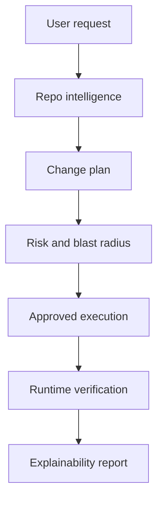

# BootRise

Architecture-aware AI engineering reliability platform.

Repository: `Agent-Work`

BootRise helps teams safely evolve existing software by combining repo intelligence, structured planning, controlled execution, runtime verification, and change explainability.

The core promise is simple: changes start with understanding and end with evidence.

## What Exists Now

- Product and architecture docs in `docs/`.
- Repo intelligence primitives:
  - file classification
  - lightweight symbol extraction
  - import dependency mapping
- Planning primitives:
  - intent interpretation
  - impacted system inference
  - risk assessment
  - ordered execution steps
  - validation plan
- Backend route:
  - `GET /api/plans` returns the example API shape
  - `POST /api/plans` creates a plan from a request
  - `GET /api/repositories/analyze` returns demo repo intelligence and health
  - `POST /api/repositories/analyze` analyzes uploaded file inputs
  - `GET /api/verification` returns the current verification gate
  - `POST /api/verification` runs configured verification commands and records evidence
  - `POST /api/diffs` creates a diff preview for an approved plan
  - `POST /api/executions` executes an approved dry run and generates preview output
  - `GET /api/history` returns in-memory workflow history
- Dry-run execution and report types.
- A clean Next.js App Router dashboard showing repo health, planning, risk, validation evidence, and usage flow.
- SQL persistence schema in `src/lib/persistence/database-schema.sql`.
- Living Ledger memory APIs:
  - `POST /api/memory/index`
  - `POST /api/memory/context`
  - `POST /api/memory/blast-radius`
  - `POST /api/orchestrator`
  - `GET /api/runs`
  - `POST /api/pulses`
  - `POST /api/blueprints`
  - `GET /api/rollbacks`
  - `GET /api/self-healing`
  - `GET /api/admin/telemetry`
  - `POST /api/admin/telemetry`
  - `GET /api/infrastructure/status`
  - `POST /api/infrastructure/git-sync`
  - `POST /api/infrastructure/preview-sessions`
  - `POST /api/infrastructure/sandbox-pool`
  - `POST /api/infrastructure/vector-sync`
  - `POST /api/infrastructure/streams`
- Mission Control dashboard:
  - interactive blast-radius radar
  - schema and data-flow visualizer
  - live sandbox terminal and preview lane
  - self-healing monitor
  - component hierarchy diff matrix
  - Living Ledger timeline slider
  - executive telemetry command center
- Infrastructure control plane:
  - Git sync network records
  - live preview session records
  - sandbox fleet telemetry
  - vector-memory indexing jobs
  - remote stream contracts for WebContainer, noVNC, Guacamole, and WebRTC adapters

## Product Name

Product name: **BootRise**

Why it works:

- Boot signals structured project foundations instead of loose prompt output.
- Rise signals the product's promise: help software grow without collapsing under complexity.
- The name avoids sounding like another prompt-to-app generator.

## Run Locally

Install dependencies, then start the app:

```bash
npm install
npm run dev
```

Useful checks:

```bash
npm run typecheck
npm run build
npm test
```

## Use the Website

1. Open the dashboard.
2. Review the current change request.
3. Inspect repo intelligence metrics.
4. Read the risk and blast-radius analysis.
5. Confirm the execution plan.
6. Run or approve the validation plan.
7. Use the report as the evidence trail for the change.

## Use the API

Analyze repository files:

```bash
curl -X POST http://localhost:3000/api/repositories/analyze \
  -H "Content-Type: application/json" \
  -d '{"files":[{"path":"src/app/page.tsx","content":"export default function Page() { return null; }"}]}'
```

Create a change plan:

```bash
curl -X POST http://localhost:3000/api/plans \
  -H "Content-Type: application/json" \
  -d '{"request":"Add organization permissions"}'
```

The response includes:

- interpreted intent
- impacted files and systems
- risk level and reasons
- execution steps
- verification checks
- rollback strategy

Read the verification gate:

```bash
curl http://localhost:3000/api/verification
```

Run verification for a plan:

```bash
curl -X POST http://localhost:3000/api/verification \
  -H "Content-Type: application/json" \
  -d '{"planId":"plan_123"}'
```

Create a diff preview:

```bash
curl -X POST http://localhost:3000/api/diffs \
  -H "Content-Type: application/json" \
  -d '{"planId":"plan_123"}'
```

Execute an approved dry run and generate a website preview:

```bash
curl -X POST http://localhost:3000/api/executions \
  -H "Content-Type: application/json" \
  -d '{"planId":"plan_123","approved":true}'
```

Index files into the Living Ledger:

```bash
curl -X POST http://localhost:3000/api/memory/index \
  -H "Content-Type: application/json" \
  -d '{"repositoryId":"demo","files":[{"path":"src/lib/billing.ts","content":"export function useOrganizationBilling() { return null; }"}],"intent":{"symbolName":"useOrganizationBilling","filePath":"src/lib/billing.ts","architecturalIntent":"Billing must remain organization-scoped.","rules":["Pass orgId on billing fetches"],"scarTissue":["Stripe webhook validation cannot be bypassed."]}}'
```

Trace blast radius:

```bash
curl -X POST http://localhost:3000/api/memory/blast-radius \
  -H "Content-Type: application/json" \
  -d '{"repositoryId":"demo","symbolName":"useOrganizationBilling"}'
```

Create a blank-canvas project blueprint:

```bash
curl -X POST http://localhost:3000/api/blueprints \
  -H "Content-Type: application/json" \
  -d '{"name":"Acme Ops","productType":"SaaS dashboard","audience":"operations teams","primaryWorkflow":"manage work orders","authRequired":true,"paymentsRequired":true}'
```

Read the last 100 operational memory records:

```bash
curl http://localhost:3000/api/runs
```

Record admin telemetry for a completed execution:

```bash
curl -X POST http://localhost:3000/api/admin/telemetry \
  -H "Content-Type: application/json" \
  -d '{"userId":"00000000-0000-0000-0000-000000000001","projectId":"demo","sessionId":"00000000-0000-0000-0000-000000000002","planningDurationMs":4200,"executionDurationMs":9800,"verificationDurationMs":12800,"selfHealingAttemptsCount":1,"finalOutcome":"COMMITTED","tokenComputeCost":0.1832}'
```

Read the infrastructure control plane:

```bash
curl http://localhost:3000/api/infrastructure/status
```

Create control-plane records for the next provider integrations:

```bash
curl -X POST http://localhost:3000/api/infrastructure/git-sync \
  -H "Content-Type: application/json" \
  -d '{"repositoryId":"demo","remoteUrl":"https://github.com/Esta-Lux/Agent-Work.git","defaultBranch":"main"}'

curl -X POST http://localhost:3000/api/infrastructure/streams \
  -H "Content-Type: application/json" \
  -d '{"repositoryId":"demo","runtime":"android","transport":"novnc","exposedPorts":[3000,8080]}'
```

## Product Loop



## Next Build Steps

1. Add a filesystem-backed repo ingestion command.
2. Replace lightweight parsing with TypeScript compiler AST extraction.
3. Persist snapshots and architecture memory.
4. Add an approval-gated execution worker.
5. Run real verification checks and store results.
6. Add browser-based route and visual smoke checks.
7. Connect Mission Control panels to streaming execution events.
8. Add GitHub OAuth, PR creation, and sandbox fleet telemetry.

## Advanced Direction

The strongest next version should include:

- Repository connection and snapshot history.
- Architecture memory with decision records.
- Interactive plan approval.
- Worker-specific execution logs.
- Visual route checks through browser automation.
- Diff previews before execution.
- Validation evidence stored per change.
- Rollback snapshots for every approved execution.
- Project health trends across every repository snapshot.
