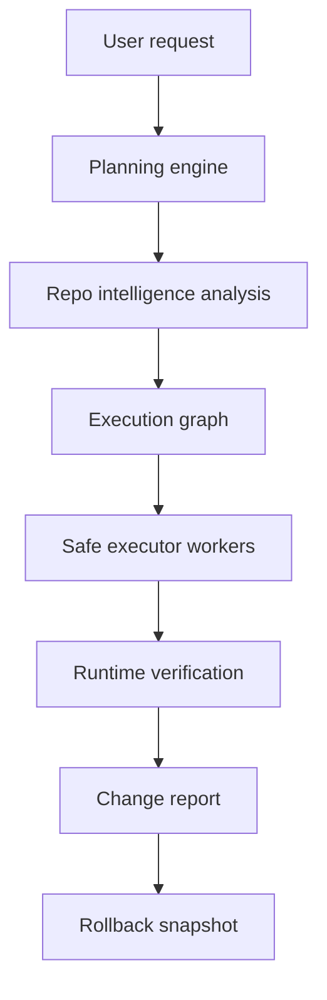

# BootRise Architecture

## High-Level Flow

## Pillars

### Repo Intelligence Engine

Builds persistent understanding of a repository:

- File inventory.
- Symbol graph.
- Dependency graph.
- Route and API map.
- Architecture memory.

### Planning Engine

Converts a natural-language request into a structured plan:

- Impacted files and services.
- Blast radius.
- Risk assessment.
- Ordered execution graph.
- Validation plan.

### Execution Engine

Applies deterministic edits from an approved plan. Executors do not make architectural decisions.

Initial worker domains:

- Frontend.
- Backend.
- Database.
- Infra.
- Tests.

### Runtime Verification

Checks the system against reality:

- Build integrity.
- Type safety.
- Route behavior.
- API contracts.
- UI consistency.
- Performance signals.

Initial API surfaces:

- `POST /api/repositories/analyze` accepts uploaded file content and returns repo intelligence plus health signals.
- `POST /api/plans` converts a request into a structured plan with health and verification context.
- `GET /api/verification` exposes the current validation gate for the demo plan.
- `POST /api/diffs` creates a reviewable generated-file preview before execution.
- `POST /api/executions` requires explicit approval and stores dry-run worker output.
- `POST /api/verification` runs configured verification commands and records pass/fail evidence.
- `GET /api/history` exposes the in-memory workflow state for debugging.

## Persistence

The current scaffold uses an in-memory store for local workflow state and ships a SQL schema at `src/lib/persistence/database-schema.sql`.

Tables:

- repositories
- repo_snapshots
- architecture_memory
- plans
- diff_previews
- executions
- verification_results
- preview_projects
- rollback_snapshots
- bootrise_symbols
- bootrise_epistemic_ledger
- bootrise_sandbox_runs
- bootrise_dynamic_pulses

## Living Ledger APIs

- `POST /api/memory/index` builds static memory and records optional architectural intent.
- `POST /api/memory/context` returns exact source plus historical rules for a symbol.
- `POST /api/memory/blast-radius` traces dependent symbols from the ledger.
- `POST /api/orchestrator` runs the deterministic state transition loop for a plan.
- `GET /api/runs` returns the last 100 sandbox runs, pulses, rollbacks, and self-healing attempts.
- `POST /api/pulses` records runtime/database/network/test events into Dynamic Memory.
- `POST /api/blueprints` creates a blank-canvas architecture blueprint before code generation.
- `GET /api/rollbacks` returns rollback snapshots captured before orchestrator writes.
- `GET /api/self-healing` returns proposed repair attempts.
- `GET /api/admin/supabase/health` checks whether Supabase persistence is configured and reachable.

### Recovery

Records rollback snapshots and validation results so failed changes can be reverted or repaired safely.

## Early Technical Choices

- Next.js App Router for the app shell.
- Tailwind for UI consistency.
- Zustand only when state complexity justifies it.
- PostgreSQL plus pgvector when persistence begins.
- Drizzle once database schema lands.
- No orchestration framework until the execution graph needs it.
