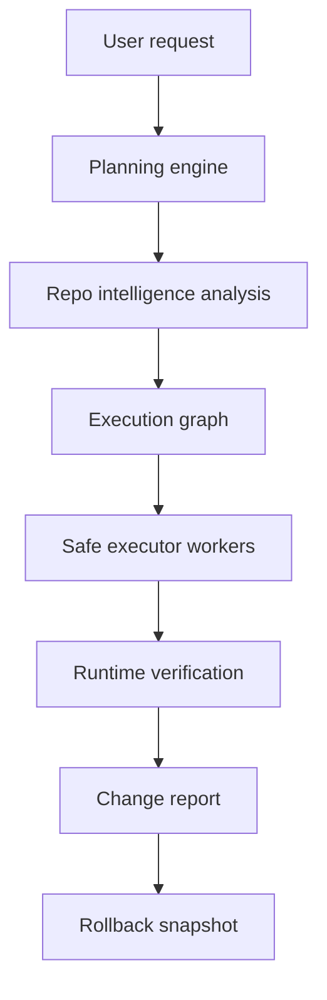

# VerityOS Architecture

## High-Level Flow

## Pillars

### Repo Intelligence Engine

Builds persistent understanding of a repository:

- File inventory.
- Symbol graph.
- Dependency graph.
- Route and API map.
- Architecture memory.

### Planning Engine

Converts a natural-language request into a structured plan:

- Impacted files and services.
- Blast radius.
- Risk assessment.
- Ordered execution graph.
- Validation plan.

### Execution Engine

Applies deterministic edits from an approved plan. Executors do not make architectural decisions.

Initial worker domains:

- Frontend.
- Backend.
- Database.
- Infra.
- Tests.

### Runtime Verification

Checks the system against reality:

- Build integrity.
- Type safety.
- Route behavior.
- API contracts.
- UI consistency.
- Performance signals.

### Recovery

Records rollback snapshots and validation results so failed changes can be reverted or repaired safely.

## Early Technical Choices

- Next.js App Router for the app shell.
- Tailwind for UI consistency.
- Zustand only when state complexity justifies it.
- PostgreSQL plus pgvector when persistence begins.
- Drizzle once database schema lands.
- No orchestration framework until the execution graph needs it.
